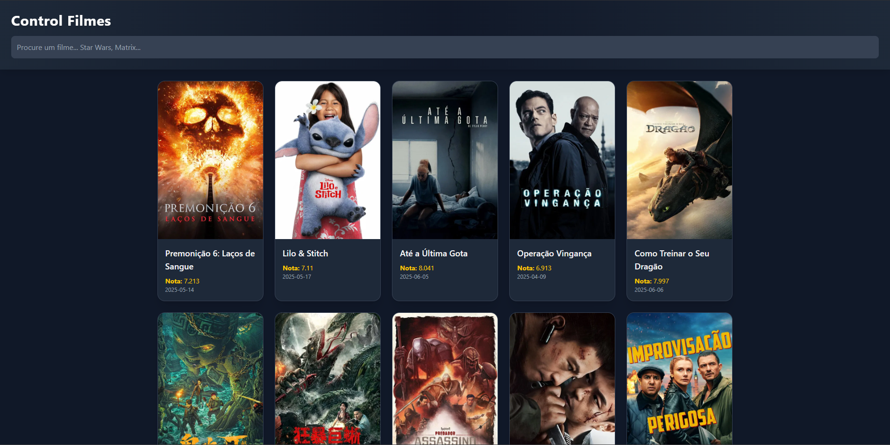
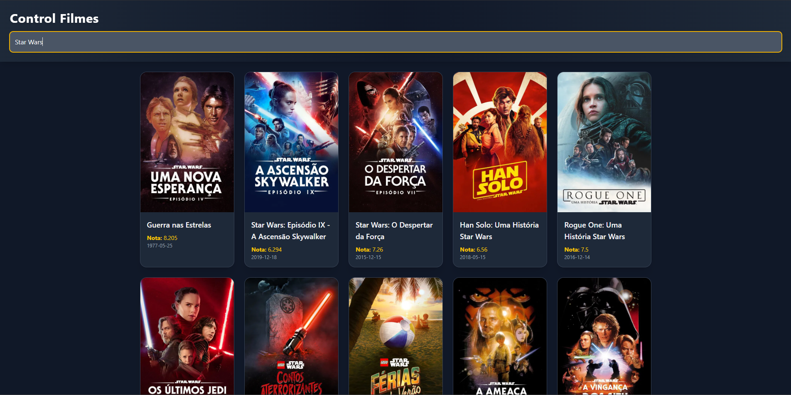

# Interface Web de Filmes
Esta é uma **Interface Web** desenvolvida com **Angular**, **Tailwind CSS** e **TypeScript**, que consome uma API pública de filmes.



## Tecnologias Utilizadas
-   **Angular** 
    
-   **Tailwind CSS**
    
-   **TypeScript**

## Funcionalidades

-   ✅ Visualizar informações sobre filmes
-   ✅ Pesquisar por filmes específicos



## Como Rodar 
### Pré-requisitos:
-   Node.js 
-   Angular CLI  

1. **Clone o repositório:**
   ```bash
   git clone https://github.com/gxstavomiguel/filmes-web-frontend
2. **Abra o projeto no Visual Studio Code.**

3. **Rode o servidor:**
``
	ng serve
   ``

4. **Inicie o projeto.**
   ```bash 
   A aplicação estará disponível em: http://localhost:4200


